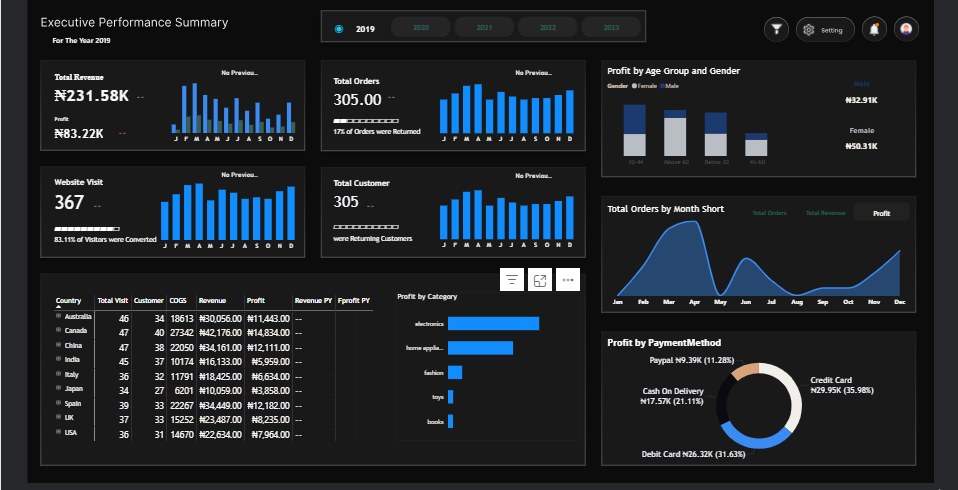

# Executive Performance Summary Dashboard 5-Year Analytical Report(2019-2023)

## Executive Summary

This project analyzes five years of e-commerce performance (2019–2023) to identify trends in revenue, profit, customer behavior, product categories, and payment methods. The analysis revealed a growth phase peaking in 2021 followed by a two-year contraction, with **Electronics** and **Home Appliances** emerging as the most profitable categories and the **35–44 age group** driving consistent revenue. Key insights include a surge in **return rates (17% in 2023)**, volatile **payment method preferences** with **Cash On Delivery dominating**, and significant geographic profit swings, particularly in **China** and the **USA**. These findings highlight operational and market risks while guiding targeted strategies to optimize product mix, customer engagement, and international performance. Overall, the project delivers actionable insights to **improve profitability, stabilize customer retention, and inform data-driven strategic decisions**.

You can explore the full interactive Executive Performance Summary Dashboard [here](https://app.powerbi.com/view?r=eyJrIjoiNmI1YzcwMmYtYTMzOC00NzE5LWJlMzYtZTZlMDViYTc5M2Y2IiwidCI6IjU3ODlhOGIxLWFjN2MtNDMxZS05YTQyLWJlOTk0NTNjNWIzMCJ9).
## Business Problem

The e-commerce business faced declining profitability and inconsistent growth from 2019–2023, driven by fluctuating revenue, profit, and customer engagement. High return rates (peaking at 17% in 2023), volatile payment method preferences, and unstable geographic performance created operational inefficiencies and financial risk. Additionally, shifts in product category profitability and changing customer demographics challenged decision-making, making it difficult for executives to reliably forecast performance and optimize strategies. 

## Methodology

The project follows a structured, end-to-end analytical approach to evaluate e-commerce performance:

1. **Data Collection**  
   - Integrated three primary datasets: Customer Fact Table, Country-Level Performance Data, and Country Flags.  
   - Datasets cover transactions, revenue, profit, customer demographics, product categories, payment methods, and geographic metrics from 2019–2023.

2. **Data Cleaning & Transformation**  
   - Handled missing and inconsistent values.  
   - Standardized date formats, numeric fields, and categorical variables.  
   - Calculated key metrics including Return Rate, Conversion Rate, Loyalty Rate, and Average Order Value (AOV).

3. **Data Modeling & Analysis**  
   - Built a unified data model linking customers, orders, products, and geography.  
   - Created DAX measures in Power BI for KPIs, YoY comparisons, and segment analysis.  
   - Applied demographic, category, and geographic segmentation to identify trends, anomalies, and high-value segments.

4. **Visualization & Insights**  
   - Designed an executive-friendly Power BI dashboard with global filters, KPI cards, trend charts, and tables.  
   - Visualizations highlight growth, decline, and volatility across revenue, profit, customer segments, payment methods, and geographies.  

**Rationale:**  
This approach ensures data integrity, enables multi-dimensional analysis, and delivers actionable insights. Power BI was chosen for its interactive visualization capabilities, allowing executives to explore trends dynamically and make informed, data-driven decisions.

## Skills & Tools Applied

- **Data Analysis & Modeling:** Data cleaning, transformation, and aggregation; KPI calculations; segmentation analysis  
- **Power BI:** Dashboard design, interactive visuals, filters, and slicers  
- **DAX:** Measures for revenue, profit, YoY comparisons, return rate, conversion rate, and loyalty metrics  
- **ETL Processes:** Integration of multiple datasets, data validation, and preparation for analytics  
- **Visualization Techniques:** Trend charts, bar/column charts, donut charts, tables, and KPI cards  
- **Business Insights:** Interpretation of revenue trends, category performance, customer demographics, payment behavior, and geographic profitability  

## Key Findings & Recommendations

### Key Findings
- **Revenue & Profit Volatility:** Revenue and profit peaked in 2021 (₦317.54K and ₦112.63K) before declining sharply in 2022–2023 (₦219.62K profit in 2023), driven by reduced Average Order Value (AOV) and high return rates (17% in 2023).  
- **Category Performance:** Electronics and Home Appliances consistently led profits, while lower-priced categories like Books became more important during downturns.  
- **Customer Segments:** The 35–44 age group consistently contributed the highest profits; Female customers remained stable during declines.  
- **Payment Method Shifts:** Cash On Delivery surged to 37.54% in 2023, replacing Credit and Debit Cards, indicating potential operational and cash flow risks.  
- **Geographic Instability:** Country-level profits fluctuated dramatically year-over-year; China and USA showed the most extreme swings, highlighting market risk concentration.  
- **Operational Risk:** High return rates and payment method volatility are eroding profitability and creating logistics and cash flow challenges.  

### Recommendations
1. **Optimize Product Mix:** Focus marketing and inventory on Electronics and Home Appliances, while leveraging lower-cost items like Books to stabilize revenue in downturns.  
2. **Target Key Customer Segments:** Design campaigns and loyalty programs for the 35–44 age group, with specific engagement strategies for stable Female customers.  
3. **Reduce Return Rates:** Implement stricter return policies, improve product descriptions, and enhance quality checks to lower the 17% return rate.  
4. **Payment Strategy Diversification:** Encourage Credit/Debit Card usage through incentives, while managing Cash On Delivery risk to improve cash flow and operational efficiency.  
5. **Geographic Risk Mitigation:** Diversify marketing and sales focus across multiple countries to reduce dependence on volatile markets like China and the USA.  
6. **Monitor AOV & Margins:** Introduce pricing strategies or bundled offers to increase Average Order Value, offsetting declines in total orders and stabilizing profit margins.

## Next Steps / Future Work

- **Predictive Analytics:** Implement forecasting models for Revenue, Profit, and Return Rates to anticipate seasonal trends and optimize inventory and marketing decisions.  
- **Customer Segmentation & Personalization:** Use clustering or ML techniques to identify high-value customers and tailor promotions, improving retention and conversion rates.  
- **Automated Dashboards:** Enhance the Power BI dashboard with real-time data integration and automated alerts for KPI deviations (e.g., spikes in returns or changes in payment method usage).  
- **Operational Efficiency Improvements:** Automate return processing analysis and payment method tracking to reduce delays, costs, and cash flow risks.  
- **Geographic Risk Analysis:** Develop risk scoring for countries to guide expansion, marketing, and inventory allocation decisions.  
- **Scenario Planning:** Introduce "what-if" simulations to model impacts of pricing, promotional strategies, or shifts in payment methods on revenue and profit.

## Project Limitations

- **Historical Data Scope:** The analysis covers only 2019–2023, limiting the ability to identify longer-term trends or the impact of macroeconomic events outside this period.  
- **Data Completeness:** Some datasets may have missing or estimated values, particularly in country-level performance metrics and payment method distributions.  
- **Customer-Level Granularity:** Limited individual-level behavioral data restricts detailed segmentation beyond age, gender, and country.  
- **External Factors Not Modeled:** Market conditions, competitor activity, and economic shocks were not explicitly incorporated, which could influence revenue, profit, and customer behavior.  
- **Return & Payment Assumptions:** Return rates and payment method impacts are based on aggregated data; nuances like partial refunds or delayed payments are not captured.  
- **Predictive Limitations:** No predictive models were applied, so forecasts and “what-if” scenarios are outside the scope of this project.
